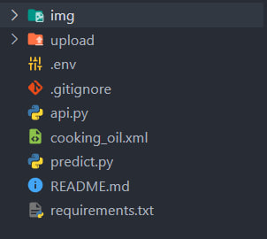

# API Predict Image

the application is built using python and the flask framework for its api. predict image using HAAR train using MATLAB (temporary).

## Requirements
1. Python >= 3.8.x
2. OpenCV >= 4.7.x

## Setup
* install necessary modules
```
$ pip install -r requirements.txt
```

* create folder named "upload"



## run
* run sample predict
```
$ python predict.py
```
* run API
```
$ python api.py
```

* example request (curl)
```python

curl --location 'http://127.0.0.1:8989/predict' \
--form 'file=@"/C:/Users/user-name/Documents/api_img_counter/img/test0.jpeg"'

```